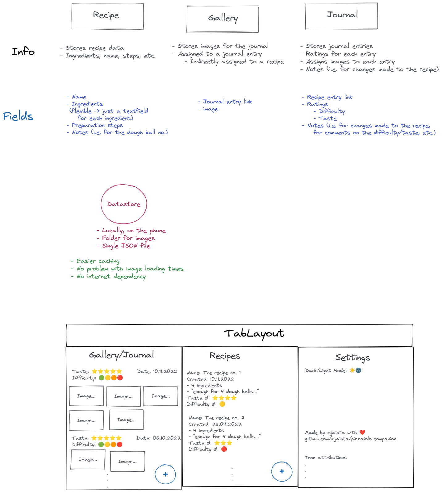

# Pizzaiolo companion

## Goal / Purpose

The goal of this app is to support pizzaiolos (pizza makers) to keep track of their pizza journeys.  
To achieve that, pizzaiolo-companion does:
- Save pizza recipes
- Help creating a journal on past pizza experiences
- Saves ratings of past experiences

## Architecture

The architecture is kept pretty simple. We got three main entities:

- Recipe: The pizza recipe
- Journal: A journal to store/log past pizza experiences
- Gallery: A place to store images of past pizza experiences, linked to journal entries

### Data storage

#### Stage 1

At stage 1, we want to store everything locally on the device.

#### Stage 2

At stage 2, we want to add an upload and download mechanism of the data inside the device to the cloud.  
The final storage destination is not defined yet, but could be one of:

- AWS S3
- Some Hetzner k3s cluster storage service

#### Stage 3

At stage 3, we want to connect data between devices, enabling:  

- Sharing of recipes, pictures, etc.
- Using one users data on multiple devices
